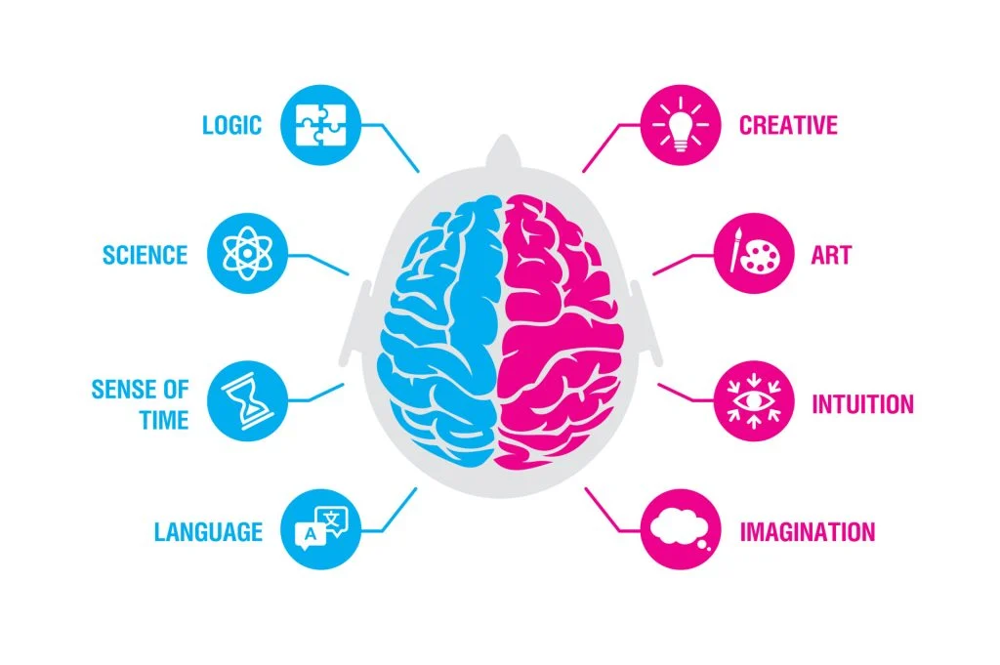

# 
 Transformer2
  

## I. It is  adaptive architecture allowing AI to evolve at time interface .

Model weights are no longer static  

   

## II. Traditional transformer are static in nature

Once trained they `can't learn` or adapt without expensive fine-tuning or additional methods like RAG.

   

## III. What's New?
#### Two-pass System  
`Pass I`: Analyze the task to understand the query.
The model identifies what `kind of task` it is facing.

`Pass II`: Dynamically `update specific` models `weights` on the task.   
It selectively amplifies or suppresses certain `brain` components (via learned vectors) to generate optimal responses

Thus making model more adaptable.  

   

## IV. It uses Selective Weight Updating

It `adjusts only task-relevent weights` during interface.
Which in return avoids costs of traditional fine-tuning also enabling real-time learning.

   

## V. Key method: Singular Value Decomposition (SVD) as a `Neural Surgeon`
The research uses SVD to dissect an LLM’s weights into independent, interpretable components - revealing specialized `pathways` for tasks like math vs. coding vs. language understanding. Enhancing specific components boosts performance without massive parameter overhead. 

   

## VI. Key method: Singular Value Fine-Tuning (SVF)
It adjusts specific components of the model's weight matrics.  

   

## VII. Why does it matter?
- Models can improve continuously at interface time without retraining.
- Can handle diverse tasks dynamically, adapting in real time.
- It is open source making easier for community to experiment.

   

## VIII. Mimic Human Cognition
As our brains activates specific regions of different taks (eg. math vs writing). Transformer2 uses modular `expert vectors` for task-specific adjustments.  
   

## IX. As a Result
- Transformer2 outperforms traditional methods like LoRa in efficiency and accuracy.

- It achives better results with fewer parameters and less resource usage.

- Not only limited for laguage task but also works well for Vision models, demonstrating its verstility across different domains.  

   

## X. What's Next?
This could be major leap for AI, bridging the gap between static modeles and dynamic, ever evolving system.

[Original Paper](https://arxiv.org/pdf/2501.06252)